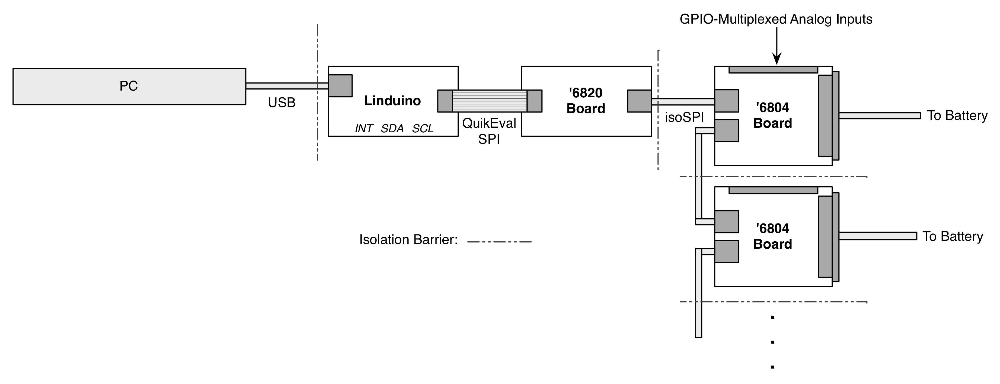

# LT BMS

LT BMS is a Battery Management System (BMS) based on Linear Technology's (LT's) LTC6804 Multicell Battery Monitor Chips and the Arduino Uno (or Linduino One) microcontroller board. It provides an API to control and read data from '6804 chip chains.

This repository includes:

- Two C++ classes for controlling stacks of addressed LTC6804-2 chips or DC9143C demonstration boards connected on a multidrop isoSPI bus. These include functionality to write configuration registers, read battery cell voltages and status registers, and control General-Purpose Input-Output pins on each chip (e.g. to interface thermistors).
- Several Arduino sketches that demonstrate the functionality of the LTC6804 and DC9143C classes.
- An Ardiono sketch that controls a Manzanita Micro PFC charger based on cell voltage readings from DC9143C demonstration boards.

## 1 Instalation

1. Download the [Arduino IDE](https://www.arduino.cc/en/Main/Software).
2. Download or clone this repository onto your machine:

  ```
  $ git clone https://github.com/whileman133/lt_bms.git
  ```
  
3. Either change the Arduino Sketchbook location to the cloned repository (`lt_bms` directory) or add the folders under `libraries` to your Arduino libraries folder.

## 2 Overview

The interface consists of two C++ classes: `LTC6804_2_Stack` for functionality pertaining to stacks of bare LTC6802-2 battery management chips and `DC1942C_Stack`, a subclass of `LTC6804_2_Stack` adding functionality to read the multiplexed analog inputs on DC1942C demonstration boards. Figure 1 shows a typical configuration of a LTC6804 chip stack.

__Figure 1: LTC6804 stack diagram__


The `LTC6804_2_Stack` class leverages the Timer/Counter1 of the ATmega48 microcontroller contained on the Linduino board to keep the LTC6804 chip's watchdog timers from expiring and reseting their configuration bytes.

Most of the API's digital-architecture dependent functionality (i.e. the LTC6804-2 chip's memory map) can be altered by changing program-memory lookup tables rather than the code itself.

## 3 Usage

To use the interface, place the folders in the `libraries` directory of this project in your Arduino libraries directory. Then create a sketch and construct one or more `DC1942C_Stack ` objects (the API will control more than one stack at a time if needed):

```cpp
#include <DC1942C_Stack.h>
#include <Linduino.h>

DC1942C_Stack stack( CHIPSELECT_1 );
DC1942C_Stack stack2( CHIPSELECT_2 );
//...
```

The pin to use as the SPI chip select pin for LTC6802 SPI-to-isoSPI board interfacing the Arduino with the stack is the only parameter to the constructor.

### Stack Setup
After constructing the stack objects, call the `setup` method on each to initialize the chip-select pins. Finally, call the static `DC1942C_Stack::start()` method to enable SPI communications the watchdog reset timer:

```cpp
void setup() {
  stack.setup();
  stack2.setup();
  // ...
  DC1942C_Stack::start();
}
```

To write configuration words to the chips, you'll need to declare an array to hold the configuration group:

```cpp
uint16_t configData[LTC6804_NUM_CONFIG_WORDS] = { 0 };
```

It's recommended you place this declaration in your sketch's global scope so you can periodically read back the chips' configuration words and validate them against the correct words. Make sure to initialize the words array to zero to ensure proper functionality. (Note the `LTC6804_NUM_CONFIG_WORDS` define is included in the `DC1942C_Stack` library.)

Then use the `prepare_config` method to generate the desired configuration words for each stack:

```cpp
void setup() {
  //...
  stack.prepare_config(
    configData,
    PD_NONE,                        // GPIO pulldown enable
    REF_ON,                         // REFON bit
    ADC_OPT_1,                      // ADCOPT bit
    // Use included macros to generate codes corresponding to under- and over-voltage values
    UV_THRESHOLD_CODE(2.0),         // Undervoltage threshold
    OV_THRESHOLD_CODE(3.6),         // Overvoltage threshold
    D_NONE,                         // Cell discharge shunt enable
    DISCHARGE_TIMEOUT_OFF           // Cell discharge timer
  );
}
```

Write the prepared comfiguration to all of the chips in a stack via the following:

```cpp
#define NUM_ICS 6
// addresses of the ICs in the stack
const uint8_t IC_ADDRESSES[NUM_ICS] = { 0, 1, 3, 4, 6, 7 };
// ...
void setup() {
  // ...
  stack.config_all( NUM_ICS, IC_ADDRESSES, configData )
}
```

### Fetching Data

Use the `start_cell_voltage_adc`, `adc_delay`, and `verify_all_config` methods to read cell-voltages in either fixed-point or floating-point format.

The `thermistor_read_all` method can be used to read temperature data when thermistors are connected to the multiplexed inputs.

See the `DC9142C_test` sketch for more useage details.

### Controling Discharge Lines

See the `DC1942C_control` sketch.
